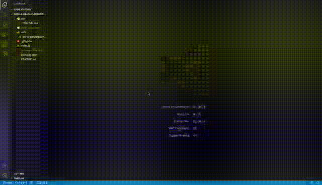

# <Simple-README-Generator>

# Simple-README-Generator
### Professional README Generator
<br>

## Features
---
You can quickly and easily create a README file by using a command-line application to generate one. This allows the project creator to devote more time to working on the project.


## Description
---
When creating an open source project on GitHub, it’s important to have a high-quality README for the app. This should include what the app is for, how to use the app, how to install it, how to report issues, and how to make contributions—this last part increases the likelihood that other developers will contribute to the success of the project.


## Usage

Use to create a command-line application that dynamically generates a professional README.md file from a user's input.

## Demonstration
---


## Technologies
---
* Javascript
* Node.js
* inquirer package


## Code 
---
```JavaScript

// render licenseLink 
function renderLicenseLink(license) {
  let licenseLink = "";
  switch (license) {
    case 'MIT':
      licenseLink = 'https://opensource.org/licenses/MIT';
      break;
    case 'IBM':
      licenseLink = 'https://opensource.org/licenses/IPL-1.0';
      break;
    case 'Mozilla':
      licenseLink = 'https://opensource.org/licenses/MPL-2.0';
      break;
    case 'Perl':
      licenseLink = 'https://opensource.org/licenses/Artistic-2.0';
      break;
    case 'Eclipse':
      licenseLink = 'https://opensource.org/licenses/EPL-1.0';
      break;
    case 'Zlib':
      licenseLink = 'https://opensource.org/licenses/Artistic-2.0';
      break;
    case 'Open Data Commons':
      licenseLink = 'https://opendatacommons.org/licenses/by/';
      break;
    default:
      licenseLink = "";
      break;
  }
  return licenseLink;
}

// Include packages needed for this application
const fs = require('fs');
const inquirer = require('inquirer');
const { default: Choices } = require('inquirer/lib/objects/choices');
const generateMarkdown = require('./utils/generateMarkdown')

// Create an array of questions for user input
const questions = [
    {
        type: 'input',
        name: 'title',
        message: 'What is your project\'s name? '
    },
    {
        type: 'input',
        name: 'description',
        message: 'Please write a short description of your project: '
    },
    {
        type: 'input',
        name: 'installation',
        message: 'What command should be run to install dependencies? '
    },
    {
        type: 'input',
        name: 'usage',
        message: 'Please enter the usage of your project: '
    },
    {
        type: 'list',
        name: 'license',
        message: 'What kind of license should your project have? ',
        choices: ['MIT', 'IBM', 'Mozilla', 'Perl', 'Eclipse', 'Zlib', 'Open Data Commons', 'None']
    },
    {
        type: 'input',
        name: 'contribute',
        message: 'Please enter the contribution guidelines of your project: '
    },
    {
        type: 'input',
        name: 'test',
        message: 'What command should be run to run the tests? '
    },
    {
        type: 'input',
        name: 'username',
        message: 'What is your Github\'s username? '
    },
    {
        type: 'input',
        name: 'email',
        message: 'What is your email address? '
    },
];

// write README file
function writeToFile(data) {
    let fileName = './dist/README.md';
    fs.writeFileSync(fileName, data, (err) => {
        err ? console.log(err) : console.log('Your README is ready!');
    });
}

```
## Project
Project is: _completed_ 

## Contact
Created by: Ruihan Gao

feel free to contact me!

Github profile link: https://github.com/ahhyaya

Project Link: [https://ahhyaya.github.io/Simple-README-Generator/](https://ahhyaya.github.io/Simple-README-Generator/)